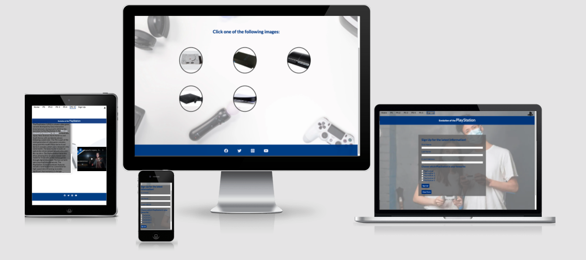
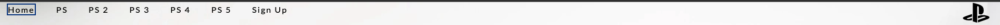
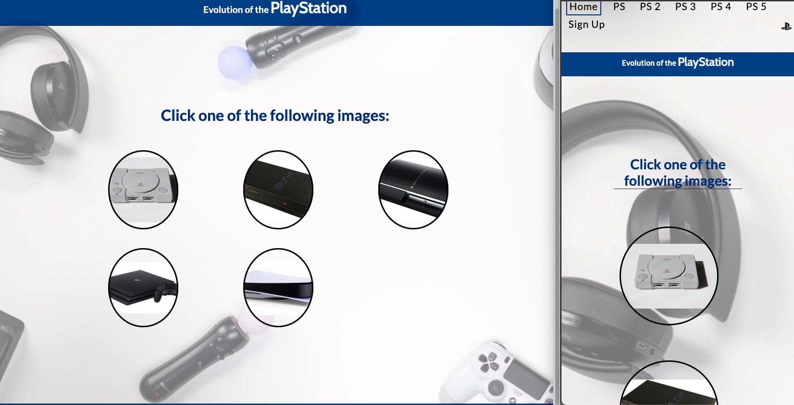
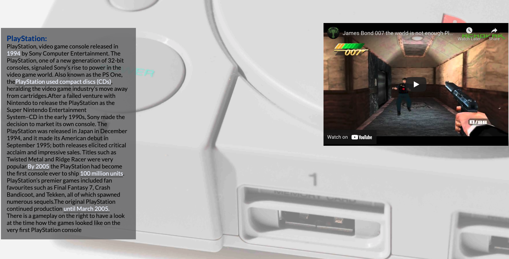
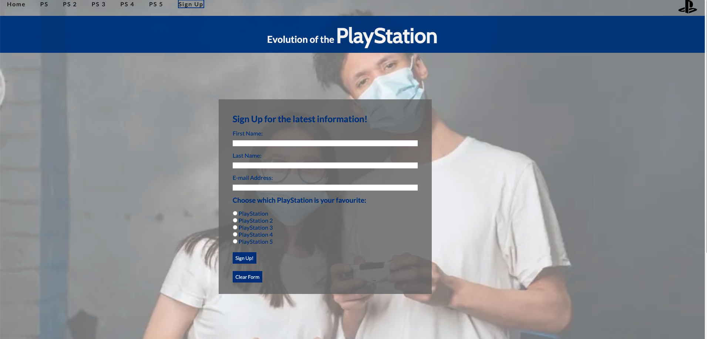

# **Evolution of the PlayStation**

On this website you can find interesting information about the playstation consoles,when were they been released and how the sales went back in their time. I put a youtube video on each pages to have a look how was the games looked like on the different consoles. The site is targeting the people who likes these consoles and would like to know about the history of them.

## **Features**

* *Navigation bar*

    * I made a navigation bar on all the pages just to make it easier to go over different pages without going to the home page.

    * It is full responsive on all the devices and has a logo on the right side.

 

* *Main section*

    * At this section you can choose which playstation you would like to read about and for this you just have click on the picture.

    * This is responsive as well on the big screen is in two rows on the smaller screens is in a column which been advised by my mentor.

    * The background been downloaded from [Pexels free pictures](htttps//pexels.com/) and the small pictures just been downloaded from google.

* *PlayStation Page*

    * On this page you can read about the actual console which you chose.

    * You can watch a youtube video as well about the consoles gameplay.

 

* *Sign Up Page*

    * Here you can sign up for the latest information about the consoles and you can choose which was your favourite console with radio buttons.

* *Footer*

    * On the footer you can go to different social media websites via a link.

## **Testing**

I tested my website on 4 different screen sizes all the time while I was writing it(On two monitors with different resolution, on an Iphone 12 Pro Max and on an Ipad Air 2020). It was quite challenging because on the chrome's developer tools when I choose the same device what I got it was always different on the actual device. I had problem with the navigation bar because it was almost on the middle of the page and i did not know what cause the problem until I realized I have to specify the body element to the value "grid" and the same time the footer went in to the place, with this I saved a loads of unnecessary code in the css file about the positioning. If you changing from different sizes you can see the size of the head line is getting smaller or bigger and the icon as well in the navigation bar, on the index page the chooseable images are going from rows to columns been advised by my mentor, the embedded videos size are changing as well and the position when it getting smaller and smaller and finally the sign up page going to change from a box to a full size page on the mobile phone.When I done the radio buttons on the sign up page I had to get some help from tutor support because I tried everything but I could not figure it out until they showed me the right path when I realized I used the same id in the input form as the id on the index page for the playstation images after all I had to do is change the id names and everything went perfectly.

## **Validator Testing**

* HTML
    * The message was : **_Document checking completed. No errors or warnings to show._**
    from the [W3C Validator](https://validator.w3.org/)

* CSS
    * The message was : **_Congratulations! No Error Found._** from the [W3C CSS (Jigsaw) Validator](https://jigsaw.w3.org/)